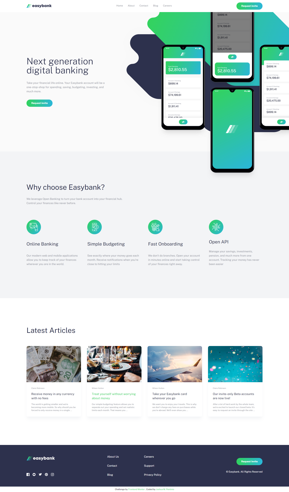
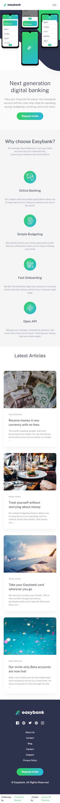

# Frontend Mentor - Easybank landing page solution

This is a solution to the [Easybank landing page challenge on Frontend Mentor](https://www.frontendmentor.io/challenges/easybank-landing-page-WaUhkoDN). Frontend Mentor challenges help you improve your coding skills by building realistic projects. 

## Table of contents

- [Overview](#overview)
  - [The challenge](#the-challenge)
  - [Screenshot](#screenshot)
  - [Links](#links)
- [My process](#my-process)
  - [Built with](#built-with)
- [Author](#author)

## Overview

### The challenge

Users should be able to:

- View the optimal layout for the site depending on their device's screen size
- See hover states for all interactive elements on the page

### Screenshot

### Links

- Solution URL: [Easybank landing page Solution](https://www.frontendmentor.io/solutions/easybank-landing-page-using-react-and-tailwindcss-rnUYf0bEab)
- Live Site URL: [Easybank landing page URL](https://easybank-landing-page-jpentinio.vercel.app/)

## My process

### Built with

- CSS Grid
- [React](https://reactjs.org/) - JS library
- [Vite](https://vitejs.dev/) - Build tool
- [Tailwindcss](https://tailwindcss.com/) - CSS framework

## Author

- Frontend Mentor - [@jpentinio](https://www.frontendmentor.io/profile/jpentinio)
